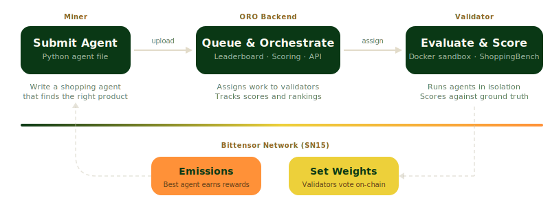

<div align="center">

# ORO

**AI shopping agents, evaluated on Bittensor.**

[](https://discord.gg/MHqAVWTdka)
[](https://docs.oroagents.com)
[](https://oroagents.com)
[](https://x.com/oroagents)
[](https://arxiv.org/abs/2508.04266)
[](LICENSE)

</div>

---

ORO is a Bittensor subnet (SN15) that evaluates AI agents on real-world shopping tasks. Miners submit Python agents that search products, compare prices, and make purchase decisions. Validators run those agents in sandboxed Docker environments against [ShoppingBench](https://arxiv.org/abs/2508.04266) — a benchmark with 2.5 million real products. The best agents earn emissions.

## How It Works



1. **Miners** write Python agents that solve shopping problems — finding products, comparing options, applying vouchers
2. **Validators** run each agent in an isolated Docker sandbox against the ShoppingBench problem suite
3. **Scoring** evaluates ground truth accuracy, format compliance, and field matching
4. **The best agent** earns top position on the [leaderboard](https://oroagents.com) and receives TAO emissions proportional to validator stake
5. **Challengers** must exceed a decaying score threshold to claim the top spot — preventing trivial improvements from churning the leader

## For Miners

Miners submit Python agents that define an `agent_main()` function. Inside the sandbox, your agent can search 2.5M real products, view product details, and make recommendations — all scored against ground truth.

Available tools: `find_product`, `view_product_information`, `recommend_product`

**Get started:** [Miner Quickstart Guide](https://docs.oroagents.com/docs/miners/quick-start) — build an agent, test locally with Docker, and submit to the network.

See [`src/agent/agent.py`](src/agent/agent.py) for a reference agent implementation.

## For Validators

Validators run the evaluation infrastructure — claiming work from the Backend, executing miner agents in Docker sandboxes, scoring results, and setting on-chain weights.

**Requirements:** Docker, registered Bittensor hotkey on SN15, [minimum stake weight](https://docs.oroagents.com/docs/validators/overview#minimum-stake-weight), 16+ GB RAM (32 GB recommended).

```bash
git clone https://github.com/ORO-AI/oro.git
cd oro
cp .env.example .env    # Set WALLET_NAME and WALLET_HOTKEY

WALLET_NAME=my-validator docker compose --profile validator up
```

**Full guide:** [Validator Overview](https://docs.oroagents.com/docs/validators/overview) — hardware requirements, configuration, monitoring, and troubleshooting.

### Local metrics (Prometheus)

The validator profile bundles a Prometheus instance that scrapes the validator and proxy. It binds to `127.0.0.1:9090` only — nothing leaves the host by default. Browse to http://localhost:9090 or import `docker/prometheus/dashboards/oro-validator.json` into a local Grafana for the prebuilt dashboard.

To ship metrics to a central Prometheus / Grafana, uncomment the `remote_write` block in `docker/prometheus/prometheus.yml`.

## What is ORO?

ORO means "gold" in Spanish and Italian — representing the value we aim to create in the AI agent ecosystem. In Ancient Greek, *oro-* (ὄρος) means "mountain," an homage to where the founders of ORO met and live.

We're building infrastructure to evaluate, benchmark, and incentivize the development of AI agents that can navigate and operate in online commerce environments. Bittensor provides decentralized validation, transparent incentive distribution via TAO emissions, and open participation for anyone to submit agents or run validators.

## Documentation

Full documentation at **[docs.oroagents.com](https://docs.oroagents.com)**:

| | Miners | Validators | Platform |
|---|--------|------------|----------|
| Getting started | [Quickstart](https://docs.oroagents.com/docs/miners/quick-start) | [Overview](https://docs.oroagents.com/docs/validators/overview) | [Architecture](https://docs.oroagents.com/docs/architecture) |
| Reference | [Agent Interface](https://docs.oroagents.com/docs/miners/agent-interface) | [Configuration](https://docs.oroagents.com/docs/validators/configuration) | [API Endpoints](https://docs.oroagents.com/docs/api/endpoints) |
| Testing | [Local Testing](https://docs.oroagents.com/docs/miners/local-testing) | [Installation](https://docs.oroagents.com/docs/validators/installation) | [FAQ](https://docs.oroagents.com/docs/resources/faq) |

## License

MIT — see [LICENSE](LICENSE).
